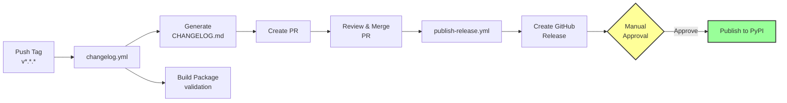

# About the Release Process

This page explains how the automated release pipeline works.

## Overview

The release pipeline converts a Git tag into a published PyPI package through a series of automated steps with a human checkpoint:

## Two Separate Workflows

The release is split into two workflows:

1. **changelog.yml** - Triggered by tag push, generates changelog, builds packages, creates a PR
2. **publish-release.yml** - Triggered by PR merge, creates GitHub Release, publishes to PyPI

Each workflow has a single responsibility - preparation vs. publication. The PR between them creates a natural review point where maintainers can verify the changelog and build before anything is published.

## Manual Approval Before PyPI

Publishing to PyPI is irreversible. The manual approval gate (via GitHub [environment protection rules](https://docs.github.com/en/actions/deployment/targeting-different-environments/using-environments-for-deployment)) provides human verification, an emergency brake for bad releases, and a clear audit trail.

## Trusted Publishing (OIDC)

The template uses PyPI's [Trusted Publishing](https://docs.pypi.org/trusted-publishers/):

- No stored secrets - authentication uses short-lived OIDC tokens generated by GitHub Actions
- Workflow-scoped - only `publish-release.yml` in the specific repository can publish
- Environment-scoped - the OIDC token is only available after manual approval

## Changelog Generation

The changelog is generated automatically from [Conventional Commits](https://www.conventionalcommits.org/) using git-cliff - `feat:` commits appear under **Added**, `fix:` under **Fixed**, breaking changes are highlighted prominently. The template enforces conventional commits at three points, because different PRs ship different
text. GitHub's `squash_merge_commit_title` defaults to `COMMIT_OR_PR_TITLE`, so a **single-commit
PR ships its commit message** while a multi-commit PR ships its **PR title** — and git-cliff reads
whichever landed. A commit-msg hook catches bad messages as you write them, a CI job validates the
commit message on single-commit PRs, and PR title validation covers the multi-commit case.

## Version Numbering

The template follows [Semantic Versioning](https://semver.org/):

- **MAJOR** (1.0.0): Breaking changes (indicated by `!` or `BREAKING CHANGE:`)
- **MINOR** (0.1.0): New features (`feat:` commits)
- **PATCH** (0.0.1): Bug fixes (`fix:` commits)

The version is determined by the Git tag - there is no version file to manually edit. The `hatch-vcs` build plugin reads the tag and sets the package version accordingly.

## The Complete Flow in Practice

1. Developer pushes a **signed** version tag: `git tag -s v0.2.0 -m "Release v0.2.0" && git push origin v0.2.0`. The signature complements the artifact-level PEP 740 attestations: those cover what was published, and the tag signature covers what it was published from.
2. `changelog.yml`'s `verify-tag-signature` job rejects the release if that tag is unsigned, or if its signature cannot be verified against a key registered on the tagger's account. Nothing runs before this job, because the tag push is what starts the workflow. See [Why the signature check runs where it does](#why-the-signature-check-runs-where-it-does) below.
3. `changelog.yml` generates the changelog, builds the package, creates a PR
4. Maintainer reviews and merges the PR
5. `publish-release.yml` creates a GitHub Release with artifacts
6. Designated reviewer receives a notification and approves the PyPI deployment
7. Package is published to PyPI via Trusted Publishing

## Why the signature check runs where it does

A person creates the release tag, and pushing it is what starts `changelog.yml`. There
is therefore no moment at which automation can inspect the tag before it exists: by the
time any workflow runs, the tag is already public. Verification is detection, not
prevention, and the honest thing is to say so rather than to imply the check stops a bad
tag from being created.

What it does buy is cost. `verify-tag-signature` is the first automated thing to see the
tag and gates every other job through `needs`, so an unsigned tag is rejected before the
changelog PR opens, before a GitHub Release exists and before anything reaches PyPI. The
recovery is `git push --delete origin vX.Y.Z` and a re-tag, which spends a version number
and nothing else.

The job asks the GitHub API whether the signature verifies rather than grepping the tag
body for a PGP block. A tag carrying a malformed signature, or one made with a key nobody
can look up, contains the block and proves nothing, so a grep would pass on exactly the
input the check exists to reject.

Prevention would need a tag ruleset with the `required_signatures` rule, which is
repository configuration rather than anything the template can ship. That remains open;
this check is the half that travels with the code.

## Connections

- [How to Set Up CI/CD Services](../how-to/setup-cicd.md) - step-by-step setup instructions
- [GitHub Workflows](../reference/github-workflows.md) - workflow technical reference
